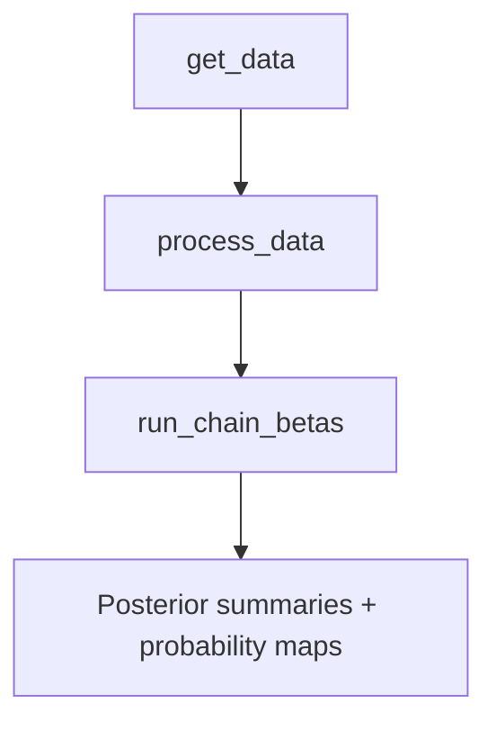

# HiCPotts 

*A Bayesian framework for detection of enriched Hi‑C interactions and experimental biases in Hi-C data*  

[](https://github.com/igosungithub/HiCPotts/actions) &nbsp;
[](LICENSE)

---

## 1  Why HiCPotts?

Hi‑C interaction counts are  

* **sparse** (most bin pairs are zero),  
* **over‑dispersed** and often **zero‑inflated**, and  
* **spatially correlated** along the genome.

**HiCPotts** deals with these challenges by combining

| Layer | Details |
|-------|---------------------------------------|
| **Spatial layer** | **Potts model** (Wu 1982) with interaction parameter \(\gamma\) to capture neighbourhood dependence. |
| **Count layer** | Mixture of three components (“noise”, “signal”, “false‑positive”) modelled with Poisson | NB | ZIP | ZINB. |
| **Bias regression** | Genomic distance, GC content, TE density and chromatin accessibility are covariates in a log‑linear model for the mean. |
| **Inference** | Metropolis‑within‑Gibbs MCMC updates betas, \(\gamma\), zero‑inflation \(\theta\) and dispersion *size* (if NB/ZINB). |

The three biological labels have a precise parameter meaning:

- **Component 1 — noise:** low baseline mean and the zero-inflation mechanism.
- **Component 2 — signal:** elevated interaction with an unrestricted
  covariate-response pattern.
- **Component 3 — false signal:** elevated noise whose standardised
  covariate-response slopes are approximately those of component 1.

The sampler encodes the component-1/3 relationship directly in the posterior:
component 3 is coupled to component 1 and component 2 remains unrestricted.
The component-2/3 crossing penalty and the biological relationship prior are
both active by default. Reversible branch and connected-block moves help the
sampler cross between competing component-2/3 allocations, while relabelling
uses all four standardised slopes and the component-1/3 intercept relationship.
These constraints give labels a scientific meaning; they cannot guarantee
three-state identifiability when the observed data contain insufficient
separation.

---

## 2  Installation

```r
## released version (once on Bioconductor)
if (!requireNamespace("BiocManager", quietly = TRUE))
    install.packages("BiocManager")
BiocManager::install("HiCPotts")

Requirements: R ≥ 4.2, C++17 compiler, plus
Rcpp, RcppArmadillo, parallel.
```
The optional genome support uses BSgenome.Dmelanogaster.UCSC.dm6 (only needed to compute GC content from raw coordinates, hence moved to Suggests):

```r
BiocManager::install("BSgenome.Dmelanogaster.UCSC.dm6")
```

## 3  Quick start

```r
library(HiCPotts)


## 1  Load long‑format interaction table
df <- read.csv("hic_interactions.csv")  # start, end, interactions, GC, ACC, TES

## 2  Convert to N×N matrices
prep   <- process_data(df, N = 40, standardization_y = FALSE)
x_vars <- prep$x_vars
y_list <- prep$y                      # list of 40×40 matrices

## 3  Run the three‑component MCMC
res <- run_chain_betas(
  N            = 40,
  iterations   = 5000,
  x_vars       = x_vars,
  y            = y_list,
  use_data_priors = TRUE,
  dist         = "ZINB",
  size_start   = c(1, 1, 1), # initial NB size for the 3 comps
  theta_start  = 0.5,        # initial theta
  seeds        = 1001L,
  mc_cores     = 1
)

## 4  Official three-component classification from sampled latent states
classified <- classify_hicpotts(
  fit  = res,
  data = df
)
head(classified)

## Optional parameter-plus-Potts probabilities
parameter_probabilities <- compute_HMRFHiC_probabilities(
  data = df, chain_betas = res, iterations = 5000,
  N = 40, dist = "ZINB", relabel = TRUE
)
head(parameter_probabilities)
```




Key exported functions

| Function | What it does |
| --- | --- |
| `get_data()` | Imports and annotates a genomic contact region. |
| `process_data()` | Converts long-format counts and covariates into the structured matrices used for fitting. |
| `run_chain_betas()` | Fits one or more datasets with a user-selected chain count and optional robust diagnostics. |
| `diagnose_hicpotts_fit()` | Reports convergence, occupancy, gamma movement and parameter reliability. |
| `summarise_hicpotts_parameters()` | Reports parameter estimates only after the selected reliability checks. |
| `classify_hicpotts()` | Official three-way classification from sampled latent-state frequencies. |
| `allocation_diagnostics()` | Quantifies membership uncertainty and between-chain disagreement. |
| `compute_HMRFHiC_probabilities()` | Computes secondary parameter-plus-Potts probabilities with configurable component definitions. |
| `summarise_hicpotts_probabilities()` | Summarises component probabilities and optional hard calls. |
| `posterior_predictive_hicpotts()` | Checks whether fitted chains reproduce important matrix features. |
| `relabel_hicpotts()` | Applies the biological component identity rule to fitted chains. |
| `plot_hicpotts_mcmc_by_component()` | Plots component-specific parameter traces. |
| `plot_upper_prob_lower_count()` | Draws a probability/count Hi-C heatmap. |

```r
mcmc1 <- res[[1]]

## trace of γ
plot(mcmc1$gamma, type = "l", col = "#1f77b4",
     main = "Potts interaction γ", ylab = "γ")

## posterior means of βs for component 1
colMeans(mcmc1$chains[[1]][-(1:2500), ])
```
Advanced options
Distribution choice – dist = "Poisson", "NB", "ZIP" or "ZINB".

Fixed vs. data‑driven priors – set use_data_priors = FALSE in the sampler and supply user_fixed_priors.

The adaptive proposal scales, move acceptance rates and stage timings are
returned in each fit; source editing is not required for routine use.

```r
set.seed(1)
N <- 10
fake <- data.frame(
  start        = rep(1:N, each = N),
  end          = rep(1:N, N),
  interactions = rpois(N*N, 5),
  GC           = runif(N*N),
  ACC          = runif(N*N),
  TES          = runif(N*N)
)

prep   <- process_data(fake, N)
res    <- run_chain_betas(N = N, iterations = 100,
                          x_vars = prep$x_vars, y = prep$y,
                          dist = "Poisson", seeds = 1L, mc_cores = 1)
```

Another example is using the test_data2.csv file inside the folder; inst/extdata
### Recommended estimation workflow

For a general-use analysis, use `run_chain_betas(robust = TRUE)`. Choose the
number of independent chains with `n_chains`; four chains are recommended for
convergence assessment. This workflow uses varied latent-state initializations,
automatic relabelling, standardized proposal coordinates and mildly
regularizing standardized-scale priors. Returned
coefficients and intervals remain on the manuscript's original log1p-covariate
scale.

The sampler uses likelihood-informed starting allocations, QR-whitened proposal
coordinates and batch-means MCSE stopping. Each chain stops when all monitored
parameters achieve the requested relative precision, or at the user-selected
iteration count. The production default is 20,000 updates, but larger values
are allowed. Optional warm-up heating remains disabled by default.

For parameter summaries, the robust wrapper screens for a replicated coherent
allocation mode. Inspect `robust_fit$mode_selection`; every original chain is
preserved in `robust_fit$all_fits`, while `robust_fit$fits` contains only the
mode-consistent chains used by downstream parameter diagnostics.

```r
robust_fit <- run_chain_betas(
  N = N,
  x_vars = scaled_data$x_vars,
  y = scaled_data$y[[1]],
  dist = "ZINB",
  theta_start = 0.5,
  size_start = c(2, 5, 10),
  robust = TRUE,
  n_chains = 4
)

parameter_summary <- summarise_hicpotts_parameters(
  robust_fit, x_vars = scaled_data$x_vars)
robust_fit$diagnostics$reliability_flags
robust_fit$diagnostics$gamma_diagnostics
robust_fit$covariate_diagnostics
```

For classification, use the latent-state draws generated by the fitted model.
The classifier pools post-burn-in membership frequencies across the selected,
relabelled chains and assigns each cell to its maximum-posterior component:

```r
classified <- classify_hicpotts(
  robust_fit,
  data = mydata                  # same order used to build the N x N lattice
)

table(classified$classification)
summarise_hicpotts_probabilities(classified)

parameter_probabilities <- compute_HMRFHiC_probabilities(
  data = mydata, chain_betas = robust_fit, iterations = 20000,
  N = N, dist = "ZINB", relabel = TRUE
)
head(parameter_probabilities)
```

`prob1`, `prob2` and `prob3` are posterior membership frequencies from the
sampler itself. This avoids both single-final-draw classification and a new
post-hoc spatial model; it does not change the underlying HiCPotts methodology.

Report component-specific coefficients together with split-Rhat, ESS, internal
component occupancy and covariate conditioning. Forced-zero classifications are not used
for coefficient, dispersion or posterior-predictive diagnostics.

Model-family, prior and known-truth validation helpers are maintained internally
for package testing and release validation rather than exposed as user-facing
analysis functions.

## 4. Feedback and bug reports
 
Please file issues at <https://github.com/igosungithub/HiCPotts/issues>.
 
License
GPL-3 © 2025 Itunu Osuntoki
